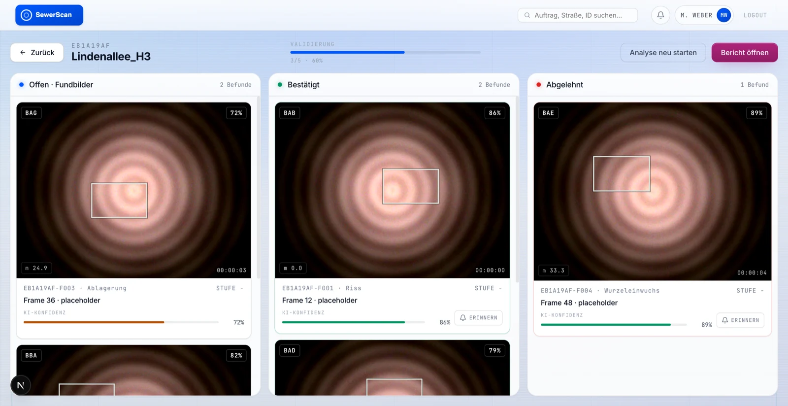
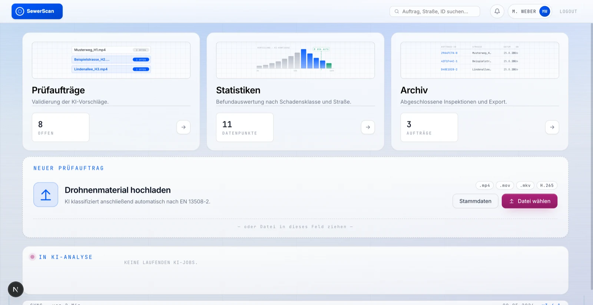
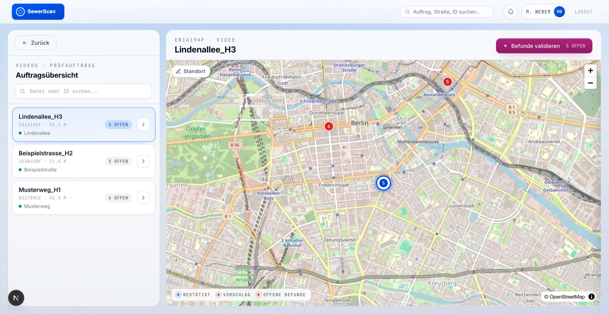
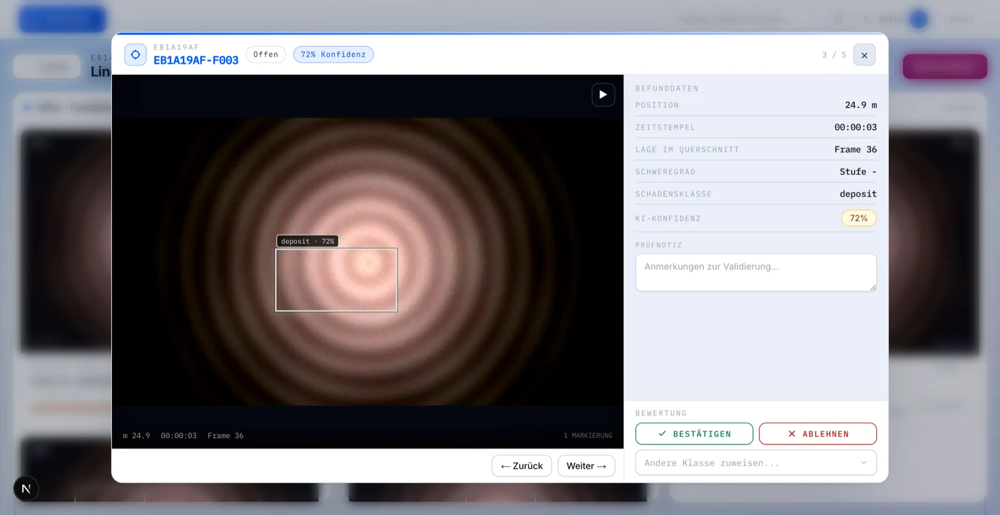
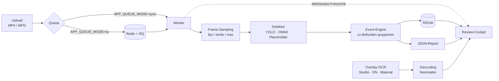

# Sewer Inspection AI

[](https://github.com/ChrBoebel/sewer-inspection-ai/actions/workflows/ci.yml)
[](LICENSE)
[](https://www.python.org/)
[](https://nextjs.org/)

**KI-gestützte Schadenserkennung in Kanal-Inspektionsvideos — mit Review-Cockpit
für die fachliche Nachkontrolle.**

*[English version: `README.md`](README.md)*

Kanalnetzbetreiber filmen ihre Haltungen mit Inspektionskameras. Das Sichten
dieser Aufnahmen ist manuelle Fleißarbeit: stundenlang Video, um einzelne
Sekunden mit Rissen, Wurzeleinwuchs oder Ablagerungen zu finden. Dieses Projekt
automatisiert den ersten Durchgang und legt die Treffer einer Fachkraft zur
Freigabe vor — Objekterkennung als Vorfilter, Entscheidung beim Menschen.



<table>
<tr>
<td width="33%"><br><sub><b>Dashboard</b> — offene Befunde, Upload, laufende Jobs</sub></td>
<td width="33%"><br><sub><b>Auftragsübersicht</b> — Inspektionen auf der Karte, Befunde je Auftrag</sub></td>
<td width="33%"><br><sub><b>Befunddetail</b> — Frame, Box, Metadaten, bestätigen oder ablehnen</sub></td>
</tr>
</table>

<sub>Die Screenshots zeigen das Modell <code>sewer-hybrid-review</code> auf
Bildern des Datensatzes
<a href="https://huggingface.co/datasets/SRuibo/Sewer-pipe-defects">SRuibo/Sewer-pipe-defects</a>
(<a href="https://creativecommons.org/licenses/by/4.0/">CC BY 4.0</a>, resized and assembled into a clip) — ein öffentlicher Datensatz, kein Betreibermaterial. Die Boxen sind
echte Modellausgaben; die Gewichte dahinter gehören nicht zu diesem Repository
(siehe <a href="DATA.md#interested-in-the-trained-weights">DATA.md</a>). Ohne
eigene Gewichte läuft stattdessen der <code>placeholder</code>-Detektor.</sub>

**Was es kann**

- Video hochladen, Frames samplen, Schäden pro Frame detektieren
- zusammenhängende Detektionen zu **Befunden** gruppieren statt Einzelframes zu melden
- sechs Schadensklassen: Riss, Muffenversatz, Wurzeln, Anschlussfehler,
  Ablagerung, Hindernis/Sonstiges
- Kamera-Overlay per **OCR** auslesen (Straße, Nennweite, Material, Meterstand,
  Neigung) und den Standort über Geocoding auf eine Karte bringen
- Befunde im **Review-Board** bestätigen, ändern, ablehnen oder mit
  Wiedervorlage versehen
- JSON-Report je Auftrag

**Technisch**

| Schicht | Stack |
| --- | --- |
| Backend | FastAPI · SQLite · RQ/Redis · OpenCV · Tesseract |
| Frontend | Next.js 16 · React 19 · TypeScript · MapLibre GL |
| Modelle | Ultralytics YOLO · ONNX Runtime · deterministischer Placeholder |

Der Analyse-Pfad ist `upload → enqueue → worker → pipeline → events → report`,
mit WebSocket-Fortschritt in die UI.

> **Keine Daten enthalten.** Weder Videos noch Frames, Annotationen,
> Betreiber-Stammdaten oder trainierte Gewichte. Der Default-Detektor ist der
> `placeholder` — die App läuft damit vollständig, erkennt aber nichts Echtes.
> Wie du eigene Gewichte einhängst: [`DATA.md`](DATA.md).
>
> Interesse an den Gewichten, die auf echtem Inspektionsmaterial trainiert
> wurden? Die gehören dem Netzbetreiber, nicht mir — frag trotzdem, ich trage
> die Anfrage weiter. Details in
> [`DATA.md`](DATA.md#interested-in-the-trained-weights).

> **Lizenz-Hinweis.** AGPL-3.0, weil Ultralytics YOLO AGPL-3.0 ist. Open-Source-
> Nutzung ist frei. Für proprietäre oder kommerzielle Nutzung brauchst du eine
> Lizenz von mir — siehe [`COMMERCIAL.md`](COMMERCIAL.md) — und zusätzlich eine
> Ultralytics Enterprise License ([`THIRD_PARTY.md`](THIRD_PARTY.md)).

## Wie es funktioniert



Jede Stufe ist einzeln austauschbar: der Detektor hinter dem
`DamageDetector`-Protocol, die Queue hinter `enqueue_analysis_job`, die
Persistenz hinter einer einzigen `Repository`-Klasse.

### API-Dokumentation

Das Backend ist FastAPI, das OpenAPI-Schema fällt also ab. Bei laufendem Stack:

| | |
| --- | --- |
| Swagger UI | <http://127.0.0.1:18137/docs> |
| ReDoc | <http://127.0.0.1:18137/redoc> |
| OpenAPI JSON | <http://127.0.0.1:18137/openapi.json> |

## Ports

Bewusst abseits der üblichen `3000` / `8000` / `6379`:

| Dienst   | Port    |
| -------- | ------- |
| Frontend | `13137` |
| Backend  | `18137` |
| Redis    | `16379` |

## Quickstart (Docker, empfohlen)

### Voraussetzungen

- **Docker Desktop** (für `backend`, `worker`, `redis`)
- **Node.js 20+** (Frontend läuft auf dem Host, nicht im Container)

macOS: `brew install --cask docker && brew install node`

```bash
git clone <dieses-repo>
cd sewer-inspection-ai
cd frontend && npm install && cd ..
bash scripts/dev-docker.sh
```

Das Skript baut beim ersten Mal das Backend-Image (~6 Min, danach Cache),
startet `redis`, `backend`, `worker` und anschließend `npm run dev` im
Vordergrund. Danach: <http://127.0.0.1:13137>

Stoppen: `Ctrl+C`, dann `bash scripts/stop-dev-docker.sh`

`data/` (SQLite, Uploads, Frames, Reports) überlebt Restarts.

### Hot-Reload

- **Frontend** — läuft direkt auf dem Host, Turbopack-Reload bleibt intakt.
- **Backend** — `backend/` ist Bind-Mount, uvicorn läuft mit `--reload`.

### Nützliche Kommandos

```bash
docker compose logs -f backend worker     # Live-Logs
docker compose ps                         # Status + Healthchecks
docker compose exec backend pytest -q     # Backend-Tests im Container
docker compose down -v                    # Stack stoppen + data-Volume leeren
docker compose build backend --no-cache   # Image neu bauen
```

## Quickstart (lokal, ohne Docker)

Braucht Python 3.12, Node 20+, `ffmpeg` und `tesseract` auf dem Host
(`brew install ffmpeg tesseract tesseract-lang`):

```bash
python3 -m venv .venv
. .venv/bin/activate
pip install -r backend/requirements.txt -r backend/requirements-dev.txt
bash scripts/dev-local.sh
bash scripts/stop-dev-local.sh
```

`dev-local.sh` nutzt `data/dev/` als Datenverzeichnis; Docker Compose nutzt
`./data/`.

### Einzelne Prozesse

```bash
# Backend
uvicorn app.main:app --app-dir backend --reload --host 127.0.0.1 --port 18137

# Worker mit Redis/RQ
REDIS_PORT=16379 docker compose up redis
PYTHONPATH=backend APP_QUEUE_MODE=rq REDIS_URL=redis://localhost:16379/0 python -m app.worker

# Frontend
cd frontend
NEXT_PUBLIC_API_BASE_URL=http://127.0.0.1:18137 \
NEXT_PUBLIC_WS_BASE_URL=ws://127.0.0.1:18137 \
npm run dev -- --hostname 127.0.0.1 --port 13137
```

### Queue-Modi

- `APP_QUEUE_MODE=rq` (Default) — braucht Redis unter `REDIS_URL`.
- `APP_QUEUE_MODE=sync` — Analyse läuft inline, ohne Redis. Wird von den Tests
  und von Playwrights `webServer` benutzt.

`backend/app/config.py` liest `APP_*`-Env-Vars für Datenverzeichnis, Sample-FPS,
Frame-Stride, Max-Frames, Job-Timeout usw.

### Kamera-Overlay-OCR

Inspektionskameras brennen Ortsangaben ins Bild. `APP_OVERLAY_CITIES`
(kommagetrennt) sagt dem Parser, an welchen Ortsnamen er sich orientieren soll —
Kameras blenden den Ort typischerweise direkt über dem Straßennamen ein:

```bash
APP_OVERLAY_CITIES="Musterstadt,Beispielheim"
```

Ohne die Variable greifen nur die ortsunabhängigen Muster (`Straße:`-Label und
`<Schacht-ID> <Straßenname>`).

## Tests

Backend:

```bash
. .venv/bin/activate
pytest -q
ruff check backend
```

Zwei Opt-in-Marker (übersprungen, solange die Env-Var fehlt):

```bash
RUN_TRAIN_SMOKE=1 pytest -m train_smoke        # synthetisches Ultralytics-Mini-Training
RUN_EXTERNAL_MODEL=1 pytest -m external_model  # lädt ISWDS-ONNX von Hugging Face
```

Beide brauchen `backend/requirements-ml.txt`.

Frontend (aus `frontend/`):

```bash
npm run lint
npm run typecheck
npm run test      # vitest
npm run e2e       # playwright, startet ein sync-mode-Backend selbst
```

## Architektur

### Backend

Ablauf: `upload → enqueue → worker → pipeline → events → report`

| Datei | Aufgabe |
| --- | --- |
| `app/main.py` | FastAPI-Routen. Uploads nach `data/uploads/`, browser-taugliches MP4-Preview, Jobs, `WS /api/jobs/{id}/stream` |
| `app/queue.py` | `enqueue_analysis_job` → direkt (sync) oder via RQ |
| `app/worker.py` | RQ-Entrypoint: `run_pipeline` + `build_report`, Statuspflege |
| `app/analysis/pipeline.py` | Frame-Sampling, Detektion pro Frame, Persistenz, `group_detections_into_events` |
| `app/analysis/model_registry.py` | zentrale `ModelSpec`-Tabelle + `build_detector` |
| `app/analysis/detectors.py` | `DamageDetector`-Protocol, `PlaceholderDetector`, ONNX-/YOLO-/Ensemble-Detektoren |
| `app/repository.py` | SQLite-Repo (videos / jobs / events / detections) |
| `app/reporting.py` | schreibt `data/reports/{video_id}.json` |
| `app/location.py` | Geocoding + OCR, State-Machine `missing → suggested → confirmed` |
| `app/overlay.py` | parst Kamera-Overlay-Text (Straße, DN, Material, Meter, Neigung) |

Ein neues Modell hinzufügen = `ModelSpec` ergänzen und den `detector_type` in
`build_detector` verdrahten.

### Frontend

`frontend/app/page.tsx` ist die zentrale Client-Komponente. Ein
`ViewLevel = 0 | 1 | 2 | 3 | 4` schaltet zwischen Login/Dashboard,
Auftragsübersicht, Review-Board, Befund-Popup und Archiv/Statistik. Die
Screens liegen in `frontend/components/screens/`, wiederverwendbare Bausteine in
`frontend/components/`, der API-Client in `lib/api.ts`, die Typen in
`lib/types.ts` (spiegelt `backend/app/schemas.py`).

Die Auftragsübersicht bindet eine MapLibre-Karte plus `LocationEditor` ein;
Marker spiegeln den `missing/suggested/confirmed`-Status.

`NEXT_PUBLIC_API_BASE_URL` und `NEXT_PUBLIC_WS_BASE_URL` sind zur Build-/
Laufzeit erforderlich.

### Demo-Login

Das Login ist eine reine Attrappe: die Nutzer stehen als Klartext-Fixture in
`frontend/lib/inspection-types.ts` (Demo-Zugang `MW-001` / `123456`), es
gibt keine Authentifizierung im Backend. **Nicht ohne echtes Auth-Konzept
deployen.**

## Mitwirken

Issues und Pull Requests sind willkommen. Vor einem PR bitte `ruff check backend`,
`pytest -q` sowie die Frontend-Skripte `lint` / `typecheck` / `test` laufen lassen.

**Niemals Inspektionsmaterial, extrahierte Frames, Trainings-Mosaike, Datensätze
oder Modellgewichte committen.** Die `.gitignore` deckt die üblichen Fälle ab,
ersetzt aber kein Nachdenken. Siehe [`DATA.md`](DATA.md).

## Lizenz

Copyright © 2026 Christopher Böbel

GNU Affero General Public License v3.0 — siehe [`LICENSE`](LICENSE).

- **Open-Source-Nutzung:** frei, solange dein Ergebnis ebenfalls unter AGPL-3.0
  steht und der Quellcode verfügbar ist. Keine Anfrage nötig.
- **Kommerzielle oder proprietäre Nutzung:** dafür brauchst du eine Lizenz von
  mir — [`COMMERCIAL.md`](COMMERCIAL.md) erklärt, wie du sie bekommst.
- **Abhängigkeiten:** Ultralytics (AGPL-3.0) und die ISWDS-Modelle
  (non-commercial) haben eigene Bedingungen — [`THIRD_PARTY.md`](THIRD_PARTY.md).
