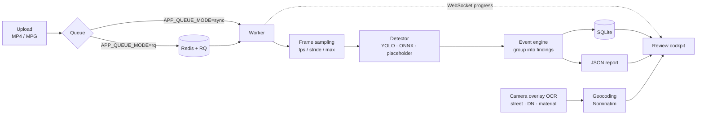

# Sewer Inspection AI

[](https://github.com/ChrBoebel/sewer-inspection-ai/actions/workflows/ci.yml)
[](LICENSE)
[](https://www.python.org/)
[](https://nextjs.org/)

**AI-assisted defect detection for sewer CCTV inspection videos — with a review
cockpit for human sign-off.**

*[Deutsche Fassung: `README.de.md`](README.de.md)*

Utilities film their sewer pipes with inspection cameras. Reviewing that footage
is tedious manual work: hours of video to find the few seconds that actually
show a crack, root intrusion, or deposit. This project automates the first pass
and hands the hits to a human for approval — object detection as a pre-filter,
the decision stays with the expert.


<table>
<tr>
<td width="33%"><br><sub><b>Dashboard</b> — open findings, upload, running jobs</sub></td>
<td width="33%"><br><sub><b>Order overview</b> — inspections on a map, findings per order</sub></td>
<td width="33%"><br><sub><b>Finding detail</b> — frame, box, metadata, confirm or reject</sub></td>
</tr>
</table>

<sub>Screenshots run the `sewer-hybrid-review` model over images from the
<a href="https://huggingface.co/datasets/SRuibo/Sewer-pipe-defects">SRuibo/Sewer-pipe-defects</a>
dataset (<a href="https://creativecommons.org/licenses/by/4.0/">CC BY 4.0</a>, resized and assembled into a clip) — a public dataset, not operator footage. The boxes are real
model output; the weights that produced them are not part of this repository
(see <a href="DATA.md#interested-in-the-trained-weights">DATA.md</a>). Out of the
box you get the <code>placeholder</code> detector instead.</sub>

**What it does**

- Upload a video, sample frames, detect defects per frame
- Group consecutive detections into **findings** instead of reporting isolated frames
- Six defect classes: crack, joint fault, roots, connection defect, deposit,
  obstruction/other
- Read the camera overlay via **OCR** (street, nominal diameter, material,
  distance, tilt) and place the inspection on a map through geocoding
- Confirm, edit, reject, or flag findings for follow-up in the **review board**
- JSON report per inspection order

**Stack**

| Layer | Technology |
| --- | --- |
| Backend | FastAPI · SQLite · RQ/Redis · OpenCV · Tesseract |
| Frontend | Next.js 16 · React 19 · TypeScript · MapLibre GL |
| Models | Ultralytics YOLO · ONNX Runtime · deterministic placeholder |

The analysis path is `upload → enqueue → worker → pipeline → events → report`,
with WebSocket progress streamed to the UI.

> **The user interface is in German.** The project targets German utilities and
> parses German camera overlays. Code, API, and documentation are English; the
> UI strings are not.

> **No data included.** No videos, frames, annotations, operator asset data, or
> trained weights. The default detector is the `placeholder` — the app runs
> fully, it just does not detect anything real. See [`DATA.md`](DATA.md) for how
> to plug in your own weights.
>
> Interested in the weights trained on real inspection footage? They belong to
> the network operator, not to me — but ask and I will take the question to
> them. [`DATA.md`](DATA.md#interested-in-the-trained-weights) has the details.

> **Licensing.** AGPL-3.0, because Ultralytics YOLO is AGPL-3.0. Open source use
> is free. For proprietary or commercial use you need a license from me — see
> [`COMMERCIAL.md`](COMMERCIAL.md) — plus an Ultralytics Enterprise License
> ([`THIRD_PARTY.md`](THIRD_PARTY.md)).

## How it works



Each stage is replaceable on its own: the detector behind a `DamageDetector`
protocol, the queue behind `enqueue_analysis_job`, the storage behind a single
`Repository` class.

### API documentation

The backend is FastAPI, so the OpenAPI schema comes for free. With the stack
running:

| | |
| --- | --- |
| Swagger UI | <http://127.0.0.1:18137/docs> |
| ReDoc | <http://127.0.0.1:18137/redoc> |
| OpenAPI JSON | <http://127.0.0.1:18137/openapi.json> |

## Ports

Deliberately away from the usual `3000` / `8000` / `6379`:

| Service | Port |
| -------- | ------- |
| Frontend | `13137` |
| Backend | `18137` |
| Redis | `16379` |

## Quickstart (Docker, recommended)

### Requirements

- **Docker Desktop** (for `backend`, `worker`, `redis`)
- **Node.js 20+** (the frontend runs on the host, not in a container)

macOS: `brew install --cask docker && brew install node`

```bash
git clone <this-repo>
cd sewer-inspection-ai
cd frontend && npm install && cd ..
bash scripts/dev-docker.sh
```

The script builds the backend image on first run (~6 min, cached afterwards),
starts `redis`, `backend`, `worker`, and then runs `npm run dev` in the
foreground. Then open <http://127.0.0.1:13137>.

To stop: `Ctrl+C`, then `bash scripts/stop-dev-docker.sh`

`data/` (SQLite, uploads, frames, reports) survives restarts.

### Hot reload

- **Frontend** — runs directly on the host, so Turbopack hot reload stays intact.
- **Backend** — `backend/` is bind-mounted, uvicorn runs with `--reload`.

### Useful commands

```bash
docker compose logs -f backend worker     # live logs
docker compose ps                         # status + health checks
docker compose exec backend pytest -q     # backend tests inside the container
docker compose down -v                    # stop stack + wipe data volume
docker compose build backend --no-cache   # rebuild image from scratch
```

## Quickstart (local, without Docker)

Requires Python 3.12, Node 20+, and `ffmpeg` plus `tesseract` on the host
(`brew install ffmpeg tesseract tesseract-lang`):

```bash
python3 -m venv .venv
. .venv/bin/activate
pip install -r backend/requirements.txt -r backend/requirements-dev.txt
bash scripts/dev-local.sh
bash scripts/stop-dev-local.sh
```

`dev-local.sh` uses `data/dev/` as its data directory; Docker Compose uses
`./data/`.

### Individual processes

```bash
# Backend
uvicorn app.main:app --app-dir backend --reload --host 127.0.0.1 --port 18137

# Worker with Redis/RQ
REDIS_PORT=16379 docker compose up redis
PYTHONPATH=backend APP_QUEUE_MODE=rq REDIS_URL=redis://localhost:16379/0 python -m app.worker

# Frontend
cd frontend
NEXT_PUBLIC_API_BASE_URL=http://127.0.0.1:18137 \
NEXT_PUBLIC_WS_BASE_URL=ws://127.0.0.1:18137 \
npm run dev -- --hostname 127.0.0.1 --port 13137
```

### Queue modes

- `APP_QUEUE_MODE=rq` (default) — needs Redis at `REDIS_URL`.
- `APP_QUEUE_MODE=sync` — analysis runs inline, no Redis. Used by the test suite
  and by Playwright's `webServer`.

`backend/app/config.py` reads `APP_*` environment variables for the data
directory, sample FPS, frame stride, max frames, job timeout, and more.

### Camera overlay OCR

Inspection cameras burn location text into the frame. `APP_OVERLAY_CITIES`
(comma-separated) tells the parser which place names to anchor on — cameras
typically print the city directly above the street name:

```bash
APP_OVERLAY_CITIES="Musterstadt,Beispielheim"
```

Without it the parser falls back to the location-independent patterns
(`Straße:` labels and `<manhole-id> <street name>`).

## Tests

Backend:

```bash
. .venv/bin/activate
pytest -q
ruff check backend
```

Two opt-in markers, skipped unless their environment variable is set:

```bash
RUN_TRAIN_SMOKE=1 pytest -m train_smoke        # synthetic Ultralytics mini training
RUN_EXTERNAL_MODEL=1 pytest -m external_model  # downloads ISWDS ONNX from Hugging Face
```

Both need `backend/requirements-ml.txt`.

Frontend (from `frontend/`):

```bash
npm run lint
npm run typecheck
npm run test      # vitest
npm run e2e       # playwright, spins up a sync-mode backend itself
```

## Architecture

### Backend

Flow: `upload → enqueue → worker → pipeline → events → report`

| File | Responsibility |
| --- | --- |
| `app/main.py` | FastAPI routes. Uploads to `data/uploads/`, browser-safe MP4 preview, jobs, `WS /api/jobs/{id}/stream` |
| `app/queue.py` | `enqueue_analysis_job` → inline (sync) or via RQ |
| `app/worker.py` | RQ entrypoint: `run_pipeline` + `build_report`, job status tracking |
| `app/analysis/pipeline.py` | Frame sampling, per-frame detection, persistence, `group_detections_into_events` |
| `app/analysis/model_registry.py` | Central `ModelSpec` table + `build_detector` |
| `app/analysis/detectors.py` | `DamageDetector` protocol, `PlaceholderDetector`, ONNX/YOLO/ensemble detectors |
| `app/repository.py` | SQLite repository (videos / jobs / events / detections) |
| `app/reporting.py` | Writes `data/reports/{video_id}.json` |
| `app/location.py` | Geocoding + OCR, state machine `missing → suggested → confirmed` |
| `app/overlay.py` | Parses camera overlay text (street, DN, material, distance, tilt) |

Adding a model = add a `ModelSpec` and wire its `detector_type` into
`build_detector`.

### Frontend

`frontend/app/page.tsx` is the central client component. A
`ViewLevel = 0 | 1 | 2 | 3 | 4` switches between login/dashboard, order
overview, review board, finding popup, and archive/stats. Screens live in
`frontend/components/screens/`, reusable building blocks in
`frontend/components/`, the API client in `lib/api.ts`, and the types in
`lib/types.ts` (mirroring `backend/app/schemas.py`).

The order overview embeds a MapLibre map plus a `LocationEditor`; markers
reflect the `missing/suggested/confirmed` status.

`NEXT_PUBLIC_API_BASE_URL` and `NEXT_PUBLIC_WS_BASE_URL` are required at build
and run time.

### Demo login

The login screen is a mock: users are a plain-text fixture in
`frontend/lib/inspection-types.ts` (demo access `MW-001` / `123456`) and
there is no authentication in the backend. **Do not deploy this without a real
auth concept.**

## Contributing

Issues and pull requests are welcome. Before opening a PR, please run
`ruff check backend`, `pytest -q`, and the frontend `lint` / `typecheck` /
`test` scripts.

**Never commit inspection footage, extracted frames, training mosaics,
datasets, or model weights.** `.gitignore` covers the usual cases, but it is no
substitute for thinking. See [`DATA.md`](DATA.md).

## License

Copyright © 2026 Christopher Böbel

GNU Affero General Public License v3.0 — see [`LICENSE`](LICENSE).

- **Open source use:** free, as long as your work is also AGPL-3.0 and its
  source is available. No permission needed.
- **Commercial or proprietary use:** you need a license from me —
  [`COMMERCIAL.md`](COMMERCIAL.md) explains how to get one.
- **Dependencies:** Ultralytics (AGPL-3.0) and the ISWDS models
  (non-commercial) carry their own terms — [`THIRD_PARTY.md`](THIRD_PARTY.md).
